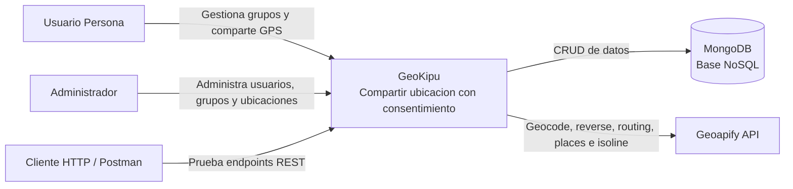
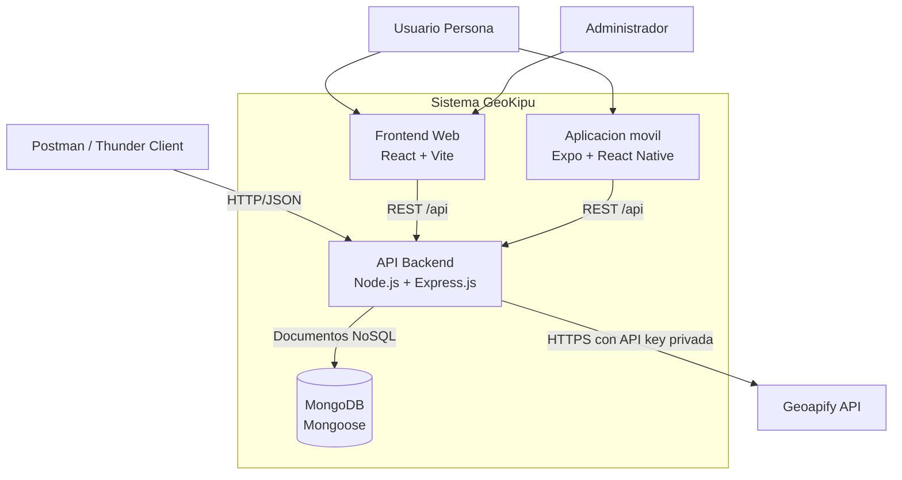
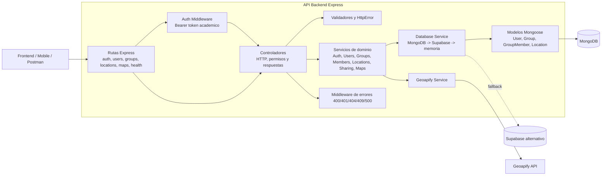

# Modelo C4 de GeoKipu

El modelo representa la arquitectura real del proyecto y los endpoints implementados en el backend Express. MongoDB es la base principal; Supabase y memoria son mecanismos alternativos de compatibilidad.

## Nivel 1 - Contexto del sistema

### Responsabilidades

- Usuario Persona: inicia sesion, consulta grupos y decide cuando compartir o pausar ubicacion.
- Administrador: administra usuarios, grupos, integrantes y ubicaciones.
- Cliente HTTP/Postman: verifica los recursos del backend para el Taller 3.
- GeoKipu: aplica autenticacion, permisos, validaciones y logica de ubicacion.
- MongoDB: persiste documentos NoSQL mediante Mongoose.
- Geoapify: provee servicios externos de geolocalizacion sin exponer la API key.

## Nivel 2 - Contenedores

### Contenedores

| Contenedor | Tecnologia | Responsabilidad |
|---|---|---|
| Frontend Web | React, Vite | Interfaz web, autenticacion, grupos, privacidad y mapas |
| App movil | Expo, React Native | Cliente movil compatible con la misma API |
| API Backend | Express.js | Rutas, permisos, validacion, servicios y proxy Geoapify |
| Base de datos | MongoDB, Mongoose | Usuarios, grupos, integrantes y ubicaciones |
| Cliente HTTP | Postman/Thunder Client | Pruebas y evidencias de endpoints |
| API externa | Geoapify | Geocodificacion, rutas, lugares e isolineas |

## Nivel 3 - Componentes del backend

### Componentes implementados

| Componente | Archivos principales | Funcion |
|---|---|---|
| Configuracion MongoDB | `src/config/database.js` | Conecta Mongoose con timeout y expone estado |
| Modelos | `src/models/*.js` | Esquemas, indices, enums y timestamps |
| Rutas | `src/routes/*.routes.js` | Define metodos y URLs reales |
| Controladores | `src/controllers/*.controller.js` | Autoriza, valida y construye JSON |
| Servicios | `src/services/*.service.js` | Separa dominio y persistencia |
| Database Service | `src/services/database.service.js` | Selecciona MongoDB, Supabase o memoria |
| Auth Middleware | `src/middlewares/auth.middleware.js` | Resuelve token y usuario activo |
| Geoapify Service | `src/services/geoapify.service.js` | Protege la API key y controla errores externos |
| Errores | `src/utils/httpError.js` | Uniforma 400, 404, 409 y 500 |

## Decisiones de arquitectura

1. Los IDs numericos publicos se conservan para no romper frontend ni mobile. MongoDB mantiene su `_id` interno y un campo `id` indexado para el contrato REST.
2. MongoDB tiene prioridad cuando `MONGODB_URI` esta configurada.
3. Supabase y memoria se conservan como fallback para compatibilidad y demostraciones sin infraestructura.
4. La clave Geoapify solo existe en backend; los clientes consumen `/api/maps/*`.
5. Las ubicaciones solo se actualizan cuando la persona activa voluntariamente el estado de comparticion.
