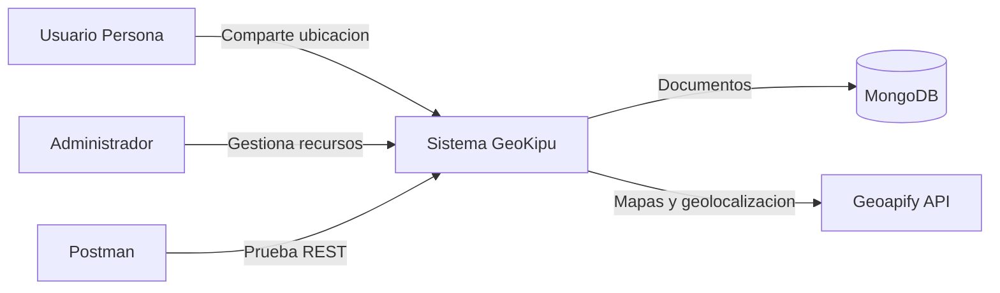
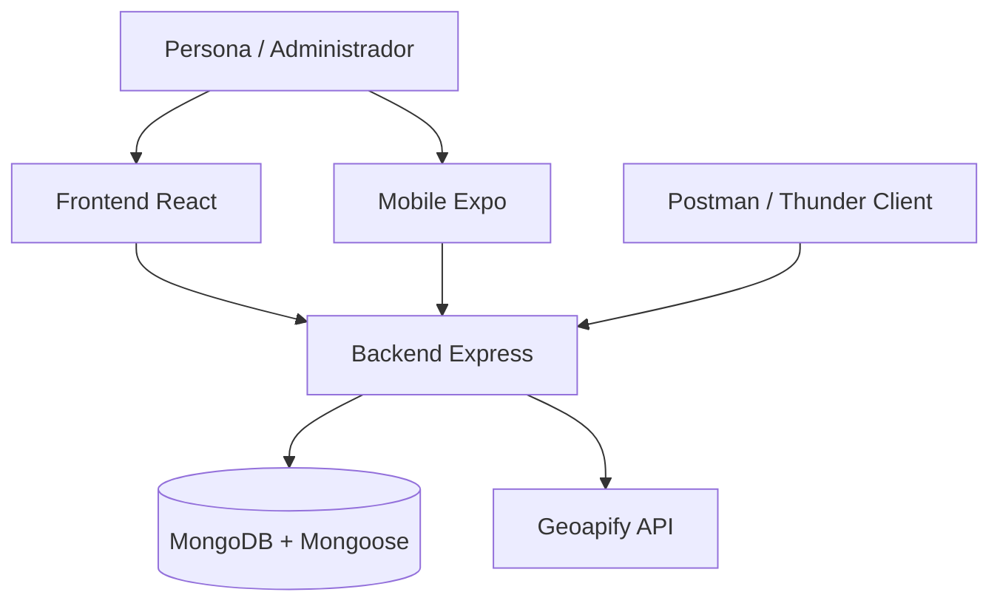
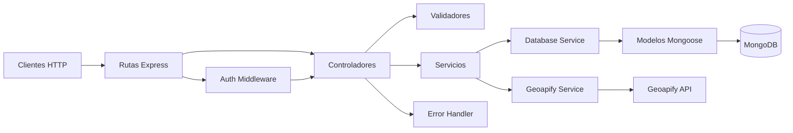

# Taller 3: Crear el backend de la aplicacion en Express.js y modelo C4

**Proyecto:** GeoKipu  
**Estudiante:** Jairo Alejandro Ojeda Herrera  
**Carrera:** Computacion  
**Materia:** Desarrollo de aplicaciones Web  
**Fecha:** ____________________  
**Docente:** ____________________

---

## 1. Introduccion

GeoKipu es una aplicacion para compartir ubicacion de forma consentida entre familiares, amigos y contactos de confianza. El backend fue desarrollado con Node.js y Express.js y expone recursos REST para autenticacion, usuarios, grupos, integrantes, ubicaciones, comparticion de ubicacion y mapas.

Para cumplir el Taller 3 se integro MongoDB como base de datos NoSQL principal mediante Mongoose. El proyecto supera el minimo de tres recursos solicitado por la rubrica porque documenta e implementa todos los modulos reales del backend.

## 2. Objetivo general

Desarrollar y documentar el backend REST de GeoKipu utilizando Express.js, MongoDB/Mongoose y el modelo C4, garantizando persistencia NoSQL, validaciones, manejo de errores y pruebas mediante un cliente HTTP.

## 3. Objetivos especificos

1. Implementar recursos REST con varios metodos HTTP para usuarios, grupos, integrantes, ubicaciones y mapas.
2. Persistir los recursos principales en MongoDB mediante modelos Mongoose validados e indexados.
3. Proteger las rutas privadas con un middleware de autenticacion academico.
4. Consumir Geoapify desde el backend para evitar exponer su API key.
5. Probar las rutas con Postman y documentar la arquitectura mediante diagramas C4.

## 4. Herramientas utilizadas

| Herramienta | Uso en el proyecto |
|---|---|
| Node.js | Entorno de ejecucion del backend |
| Express.js | Servidor HTTP y enrutamiento REST |
| MongoDB | Base de datos documental NoSQL principal |
| Mongoose | Modelado, indices, validacion y conexion MongoDB |
| Postman / Thunder Client | Pruebas HTTP y evidencias |
| Geoapify API | Geocoding, reverse, rutas, lugares e isolineas |
| WebStorm / VS Code | Desarrollo y depuracion |
| Mermaid | Diagramas del modelo C4 |

## 5. Descripcion general de GeoKipu

El sistema permite que una persona se registre, inicie sesion, cree grupos, agregue contactos y active o pause voluntariamente la ubicacion. Los integrantes autorizados pueden consultar la ultima ubicacion compartida del grupo. Un administrador puede gestionar usuarios, grupos y ubicaciones. El backend tambien funciona como proxy de Geoapify.

La privacidad se aplica con estas reglas:

- La ubicacion no se actualiza sin activacion voluntaria.
- La persona puede detener la comparticion en cualquier momento.
- Las consultas de grupo verifican que el usuario pertenezca al grupo o sea administrador.
- La API key de Geoapify no se expone al frontend ni a mobile.

## 6. Arquitectura del backend

El backend sigue una arquitectura por capas:

```text
Peticion HTTP
  -> Ruta Express
  -> Middleware de autenticacion
  -> Controlador y validacion
  -> Servicio de dominio
  -> Database Service
  -> Modelo Mongoose
  -> MongoDB
```

Las carpetas principales son:

```text
backend/src/config       Conexion a bases de datos
backend/src/models       Esquemas Mongoose
backend/src/routes       Metodos HTTP y URLs
backend/src/controllers  Permisos, validaciones y respuestas
backend/src/services     Logica de negocio y persistencia
backend/src/middlewares  Autenticacion
backend/src/utils        Validadores y errores
```

La persistencia utiliza el siguiente orden:

1. MongoDB si existe `MONGODB_URI` y la conexion responde.
2. Supabase como alternativa compatible si esta configurado.
3. Memoria para demostraciones sin infraestructura.

## 7. Conexion a MongoDB

Variable requerida:

```env
MONGODB_URI=mongodb://127.0.0.1:27017/geokipu
```

El archivo `backend/src/config/database.js` usa `mongoose.connect` con un timeout de seleccion de servidor de tres segundos. El backend crea datos academicos iniciales solo cuando las colecciones estan vacias.

Comandos de ejecucion:

```powershell
cd backend
npm install
Copy-Item .env.example .env
Get-Service MongoDB
Start-Service MongoDB
npm run dev
```

Respuesta esperada en consola:

```text
MongoDB conectado. Persistencia principal activa.
GeoKipu backend escuchando en http://localhost:4000
```

Verificacion:

```powershell
Invoke-RestMethod http://localhost:4000/api/health
```

```json
{
  "ok": true,
  "app": "GeoKipu",
  "storage": "mongodb",
  "mongodb": "connected"
}
```

## 8. Modelos de datos NoSQL

### User

Almacena `id`, `fullName`, `email`, `password`, `role`, `language`, `cedula`, `phone`, `active`, `sharingLocation`, `lastConnection`, `createdAt` y `updatedAt`. Correo, cedula y telefono son unicos.

### Group

Almacena `id`, `name`, `description`, `createdBy`, `createdAt` y `updatedAt`. `createdBy` enlaza logicamente con el ID publico de User.

### GroupMember

Almacena `id`, `groupId`, `userId`, `fullName`, `email`, `phone`, `cedula`, `relation`, `locationStatus`, `lastLocation`, `lastUpdate` y timestamps. Los estados validos son `sharing`, `paused` y `offline`.

### Location

Almacena `id`, `userId`, `groupId`, `latitude`, `longitude`, `accuracy`, `heading`, `speed`, `address`, `sector`, `sharing`, `simulated`, `lastUpdate` y timestamps. Latitud y longitud se validan contra rangos geograficos.

MongoDB conserva su `_id` interno. GeoKipu usa ademas IDs numericos publicos para mantener compatibilidad con frontend y mobile.

## 9. Endpoints implementados

Todas las rutas privadas requieren `Authorization: Bearer token-simulado-<id>`.

| Modulo | Metodo | Ruta | Descripcion | Body | MongoDB | API externa |
|---|---|---|---|---|---|---|
| Health | GET | `/api/health` | Estado de API y almacenamiento | No | Consulta estado | No |
| Auth | POST | `/api/auth/register` | Registra persona | Si | Si | No |
| Auth | POST | `/api/auth/login` | Valida credenciales | Si | Si | No |
| Auth | GET | `/api/auth/me` | Usuario autenticado | No | Si | No |
| Users | GET | `/api/users` | Lista usuarios visibles | No | Si | No |
| Users | POST | `/api/users` | Crea usuario como admin | Si | Si | No |
| Users | GET | `/api/users/me` | Perfil actual | No | Si | No |
| Users | GET | `/api/users/:id` | Consulta por ID | No | Si | No |
| Users | PATCH | `/api/users/:id` | Actualiza usuario | Si | Si | No |
| Users | DELETE | `/api/users/:id` | Elimina usuario | No | Si | No |
| Groups | GET | `/api/groups` | Lista grupos autorizados | No | Si | No |
| Groups | POST | `/api/groups` | Crea grupo | Si | Si | No |
| Groups | GET | `/api/groups/:groupId` | Obtiene grupo | No | Si | No |
| Groups | PATCH | `/api/groups/:groupId` | Actualiza grupo | Si | Si | No |
| Groups | DELETE | `/api/groups/:groupId` | Elimina grupo | No | Si | No |
| Members | GET | `/api/groups/:groupId/members` | Lista miembros | No | Si | No |
| Members | POST | `/api/groups/:groupId/members` | Agrega miembro | Si | Si | No |
| Members | PATCH | `/api/groups/:groupId/members/:memberId` | Actualiza miembro | Si | Si | No |
| Members | PATCH | `/api/groups/:groupId/members/:memberId/location-status` | Cambia estado | Si | Si | No |
| Members | DELETE | `/api/groups/:groupId/members/:memberId` | Elimina miembro | No | Si | No |
| Locations | GET | `/api/locations` | Lista ubicaciones visibles | No | Si | No |
| Locations | POST | `/api/locations` | Guarda ubicacion | Si | Si | No |
| Locations | GET | `/api/locations/:id` | Obtiene ubicacion | No | Si | No |
| Locations | PATCH | `/api/locations/:id` | Actualiza ubicacion | Si | Si | No |
| Locations | DELETE | `/api/locations/:id` | Elimina ubicacion | No | Si | No |
| Locations | GET | `/api/locations/group/:groupId` | Ubicaciones del grupo | No | Si | No |
| Locations | GET | `/api/locations/user/:userId` | Ubicacion del usuario | No | Si | No |
| Locations | PATCH | `/api/locations/user/:userId/status` | Activa o pausa estado | Si | Si | No |
| Sharing | POST | `/api/location/share/start` | Inicia comparticion | `{}` | Si | No |
| Sharing | POST | `/api/location/share/stop` | Detiene comparticion | `{}` | Si | No |
| Sharing | POST | `/api/location/update` | Actualiza GPS | Si | Si | No |
| Sharing | GET | `/api/location/group/:groupId` | Consulta grupo | No | Si | No |
| Sharing | GET | `/api/location/user/:userId` | Consulta usuario | No | Si | No |
| Sharing | PATCH | `/api/location/user/:userId/status` | Cambia estado | Si | Si | No |
| Sharing | GET | `/api/location/:userId` | Alias compatible | No | Si | No |
| Sharing | PATCH | `/api/location/share` | Alias compatible | Si | Si | No |
| Maps | GET | `/api/maps/status` | Estado del proveedor | No | No | Estado Geoapify |
| Maps | GET | `/api/maps/geocode` | Direccion a coordenadas | No | No | Geoapify |
| Maps | GET | `/api/maps/reverse` | Coordenadas a direccion | No | No | Geoapify |
| Maps | GET | `/api/maps/routing` | Calcula ruta | No | No | Geoapify |
| Maps | GET | `/api/maps/places` | Busca lugares | No | No | Geoapify |
| Maps | GET | `/api/maps/isoline` | Calcula zona alcanzable | No | No | Geoapify |
| Maps | POST | `/api/maps/mock-route` | Ruta simulada local | Si | No | No |

El detalle de bodies y respuestas se encuentra en `docs/postman-pruebas.md` y en la coleccion `docs/GeoKipu.postman_collection.json`.

## 10. API externa Geoapify

Geoapify se consume exclusivamente desde el backend:

- Geocoding: convierte texto de direccion en coordenadas.
- Reverse geocoding: convierte coordenadas en direccion.
- Routing: calcula rutas entre dos puntos.
- Places: busca lugares cercanos por categoria.
- Isoline: calcula zonas alcanzables por tiempo o distancia.

La variable `GEOAPIFY_API_KEY` no se entrega a frontend ni mobile. Los clientes llaman a `/api/maps/*`. Sin clave configurada, `/api/maps/status` informa modo simulado y las consultas externas responden un error controlado, sin detener el resto del backend.

## 11. Evidencias de pruebas HTTP

### Evidencia 1 - Servidor Express ejecutandose

**Captura requerida:** terminal con MongoDB conectado y backend escuchando en puerto 4000.

> [INSERTAR CAPTURA 1 AQUI]

### Evidencia 2 - MongoDB conectado

**Captura requerida:** `GET /api/health` con `storage: mongodb` y `mongodb: connected`.

> [INSERTAR CAPTURA 2 AQUI]

### Evidencia 3 - Crear usuario

**Captura requerida:** `POST /api/users`, body, status 201 e ID generado.

> [INSERTAR CAPTURA 3 AQUI]

### Evidencia 4 - Listar usuarios

**Captura requerida:** `GET /api/users` mostrando el usuario creado.

> [INSERTAR CAPTURA 4 AQUI]

### Evidencia 5 - Crear grupo

**Captura requerida:** `POST /api/groups` con nombre Familia Ojeda.

> [INSERTAR CAPTURA 5 AQUI]

### Evidencia 6 - Listar grupos

**Captura requerida:** `GET /api/groups` con grupo e integrante creador.

> [INSERTAR CAPTURA 6 AQUI]

### Evidencia 7 - Agregar integrante

**Captura requerida:** `POST /api/groups/:groupId/members` con status 201.

> [INSERTAR CAPTURA 7 AQUI]

### Evidencia 8 - Listar integrantes

**Captura requerida:** `GET /api/groups/:groupId/members`.

> [INSERTAR CAPTURA 8 AQUI]

### Evidencia 9 - Crear ubicacion

**Captura requerida:** `POST /api/locations` con coordenadas de Quito.

> [INSERTAR CAPTURA 9 AQUI]

### Evidencia 10 - Listar ubicaciones

**Captura requerida:** `GET /api/locations` mostrando almacenamiento MongoDB.

> [INSERTAR CAPTURA 10 AQUI]

### Evidencia 11 - Estado de mapas

**Captura requerida:** `GET /api/maps/status`.

> [INSERTAR CAPTURA 11 AQUI]

### Evidencia 12 - Geocode

**Captura requerida:** `GET /api/maps/geocode?text=Quito`; mostrar resultado Geoapify o error controlado si no existe clave.

> [INSERTAR CAPTURA 12 AQUI]

### Evidencia 13 - Colecciones MongoDB

**Captura requerida:** `mongosh` o MongoDB Compass mostrando `users`, `groups`, `groupmembers` y `locations`.

> [INSERTAR CAPTURA 13 AQUI]

## 12. Modelo C4

### Nivel 1 - Contexto



### Nivel 2 - Contenedores



### Nivel 3 - Componentes



El modelo detallado esta disponible en `docs/modelo-c4.md`.

## 13. Conclusiones

1. Express.js permitio organizar el backend en recursos REST independientes y reutilizables, superando el minimo de endpoints solicitado por el taller.
2. MongoDB y Mongoose proporcionan persistencia NoSQL, validaciones, indices y timestamps sin romper el contrato numerico que utilizan los clientes existentes.
3. La separacion entre rutas, controladores, servicios y modelos mejora la mantenibilidad y queda representada claramente mediante el modelo C4.
4. El proxy de Geoapify protege la API key y permite controlar fallos externos sin afectar los recursos principales.

## 14. Recomendaciones

1. Reemplazar los passwords academicos por hashes con bcrypt y los tokens simulados por JWT antes de un entorno productivo.
2. Configurar MongoDB Atlas con usuario de privilegios minimos, red restringida y copias de seguridad.
3. Automatizar pruebas de integracion para los recursos Users, Groups, Members y Locations.
4. Mantener `GEOAPIFY_API_KEY` solo en variables privadas del backend y aplicar limites de consumo.
5. Exportar este documento a PDF despues de insertar las capturas solicitadas y verificar que los diagramas Mermaid se rendericen correctamente.

## 15. Cumplimiento de la rubrica

| Requisito | Cumplimiento |
|---|---|
| Backend Express.js | Cumple |
| Base NoSQL MongoDB | Cumple mediante Mongoose |
| Minimo 3 recursos | Cumple; implementa Auth, Users, Groups, Members, Locations, Sharing, Maps y Health |
| Dos metodos por recurso | Cumple en los recursos principales |
| Pruebas HTTP | Cumple con guia y coleccion Postman |
| Modelo C4 | Cumple con contexto, contenedores y componentes |
| Documento final | Cumple; preparado para Word/PDF y evidencias |
